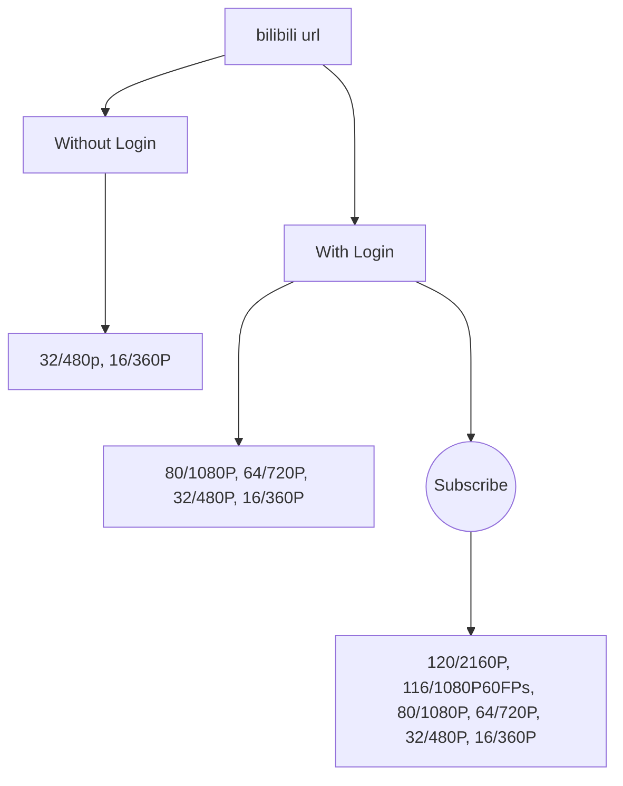
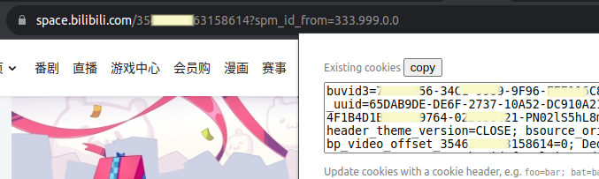

<div align="center">
    <h2>Bilibili-dl</h2>

---

PHP cli Tool for download videos from bilibili.com

[](https://www.php.net/releases/#7.4.33)
[](https://github.com/MoyuScript/bilibili-api)
[](#)
[](https://opensource.org/licenses/MIT)
[](https://github.com/motebaya/Picuki/stargazers)
[](https://github.com/motebaya/Picuki/network/members)

</div>

## Introduction

CLI tool for downloading videos from the bilibili.com website. although you can download directly from the mobile app, but you'il see annoying watermark and limited video quality (unless you subscribe to bilibili).

for example see:



so, to get high quality from webpage you need a login and set cookie. see [How to get and set cookies](#Cookies)

## Install

```bash
git clone https://github.com/motebaya/bilibili-dl
cd bilibili-dl
composer i
```

`composer`: https://getcomposer.org/download/
`main`: `php7.4 cli.php`

## Usage (CLI):

- `-u`,`--url/userid`: url video or user id
- `-b`, `--bookmark`: action to download from bookmark/favorite list
- `-t`, `--type`: method type [webpage, api, site]

* Method list

  - `webpage`:

    direct scrape from url video,
    this method will be download separated media (video and audio).
    then merger it using [PHP-FFMpeg](https://github.com/PHP-FFMpeg/PHP-FFMpeg)

    if you see an error:

    ```
    Fatal error: Uncaught Alchemy\BinaryDriver\Exception\ExecutableNotFoundException: Executable not found, proposed :
    ```

    try change `ffmpeg` and `ffprobe` default path to [this line](src/Downloader/Merger.php#L24) with your binary path.see [official docs](https://github.com/PHP-FFMpeg/PHP-FFMpeg#documentation).

    e.g : `https://www.bilibili.com/video/BV<videoid>`

  - `api`: download using [bilibili api](https://socialsisteryi.github.io/bilibili-API-collect/)

  - `site`: download from external downloader website: [youtube4kdownloader](https://youtube4kdownloader.com/)

- Example Usage:

  download from url with method webpage:

  - `php7.4 cli.php -u https://www.bilibili.com/video/BV<videoid> -t webpage`

  download from bookmark by userid with method api:

  - `php7.4 cli.php -u 32638440 -t api -b`

downloaded media will saved in default folder "src/Downloader/media" with name "media-title.[ext]", you can move it manually.

## Cookies

this is optional, for used to get more high quality only.

1. Login you account to bilibili.com, you can using addon/extension [Cookiedough](https://chrome.google.com/webstore/detail/cookiedough/hacigcgfiefikmkmmmncaiaijoffndpl).
   
2. copy your cookies and put (overwrite) to file [cookies](cookies)

## Issue

- not all stream audio or video from webpage always work, sometime you'il see unavailabe response. e.g:

```<HTML><HEAD><TITLE>Error</TITLE></HEAD><BODY>
An error occurred while processing your request.<p>
Reference&#32;&#35;132&#46;e6eece17&#46;1694877766&#46;1654822b
</BODY></HTML>
```

and

```<!DOCTYPE HTML PUBLIC "-//IETF//DTD HTML 2.0//EN">
<html>
<head><title>403 Forbidden</title></head>
<body>
<h1>403 Forbidden</h1>
<p>You don't have permission to access the URL on this server.<hr/>Powered by Tengine</body>
</html>
```

- also for external site [youtube4kdownloader](https://youtube4kdownloader.com/) sometime give error response, e.g:

```
An error occurred from remote video site. Please try with other download link
```

- and last, for Api's. it's seem not work with hotspot network. bcs im try it in my mobile network it's work as well, but in my PC stuck loading. idk, why ??

## Refference

- https://github.com/MoyuScript/bilibili-api
- https://github.com/SocialSisterYi/bilibili-API-collect

## License

This project is licensed under the [MIT License](LICENSE).
